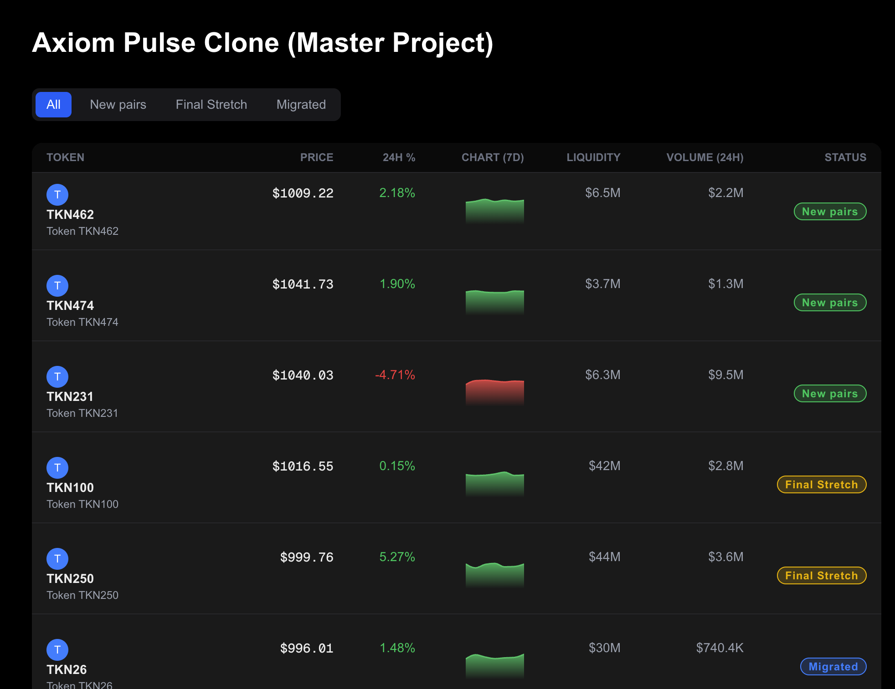
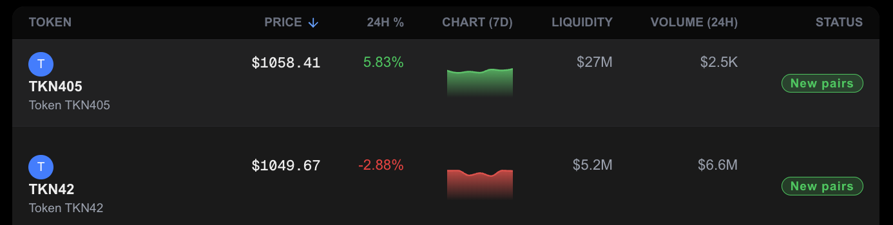
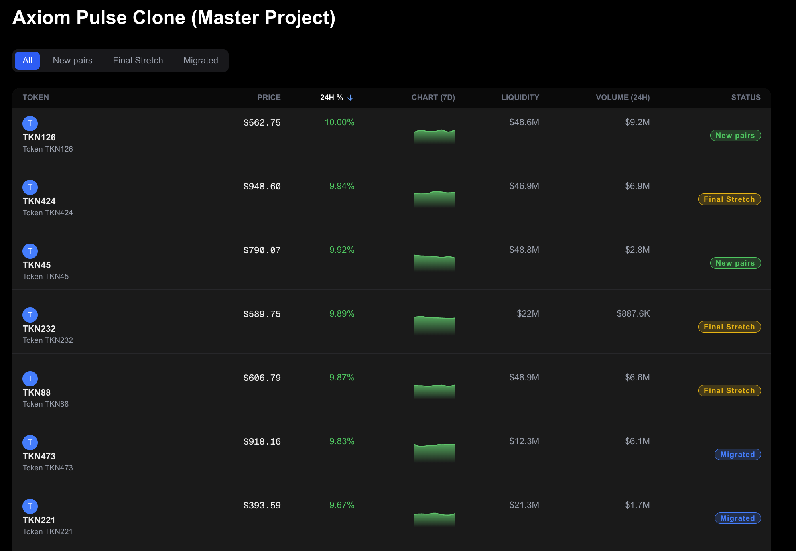
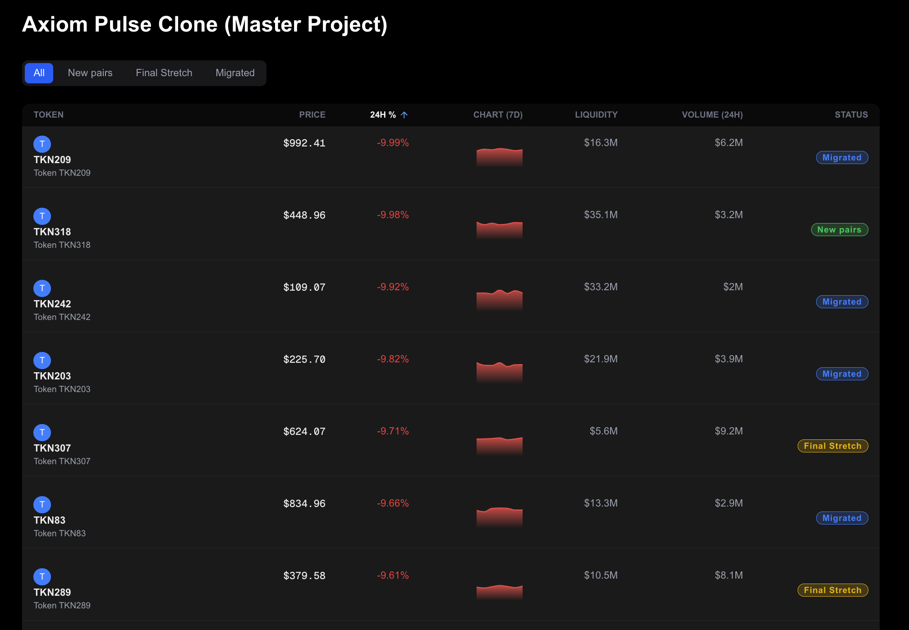
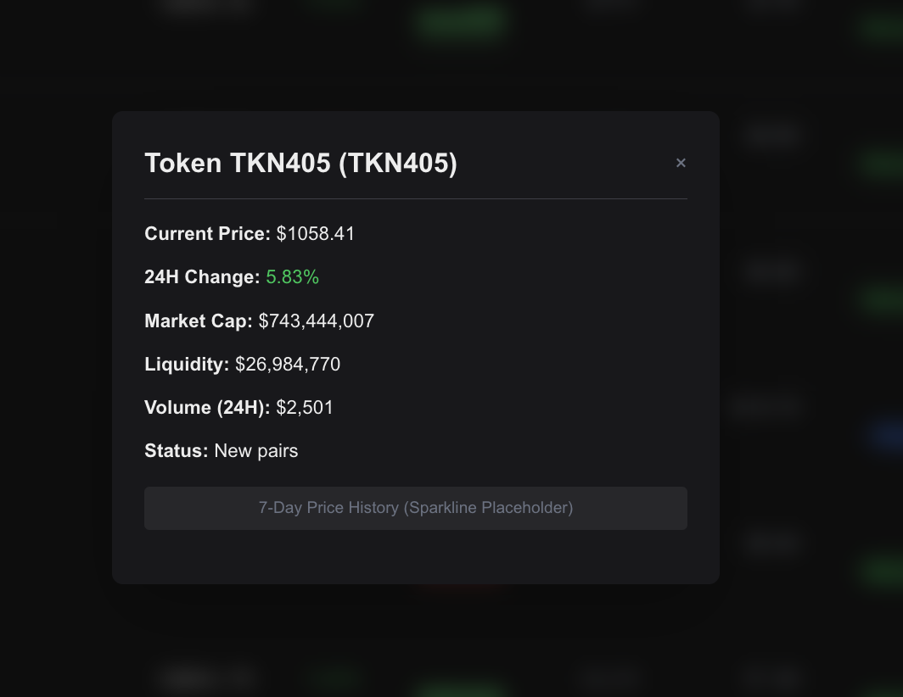
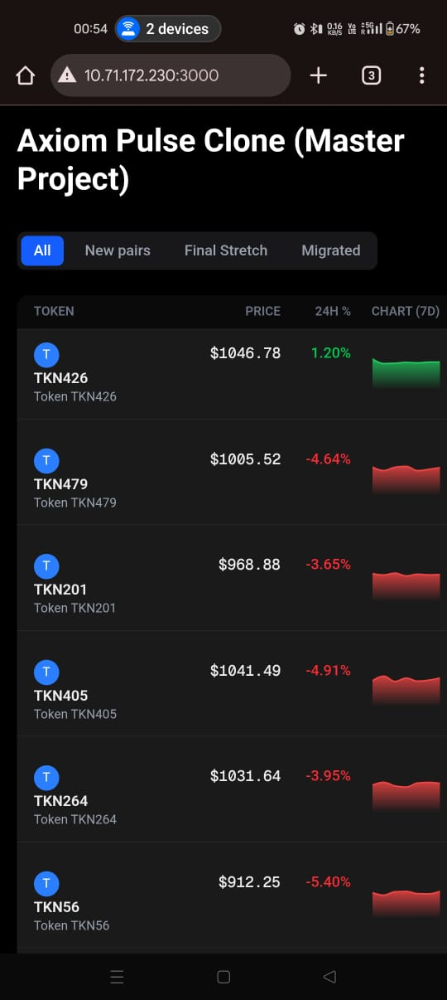
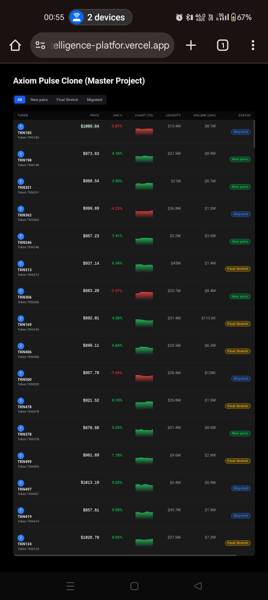
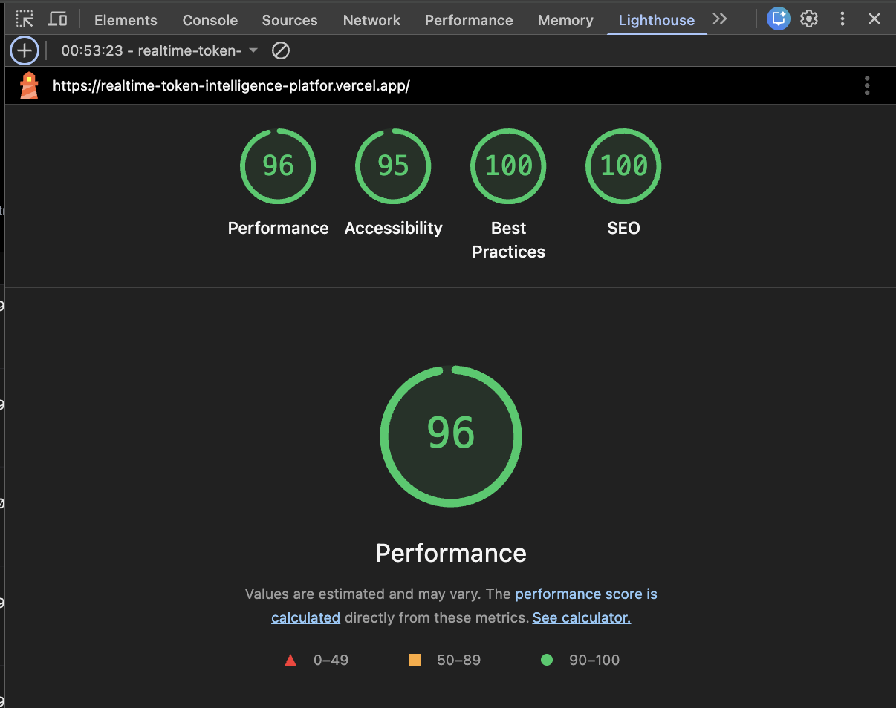
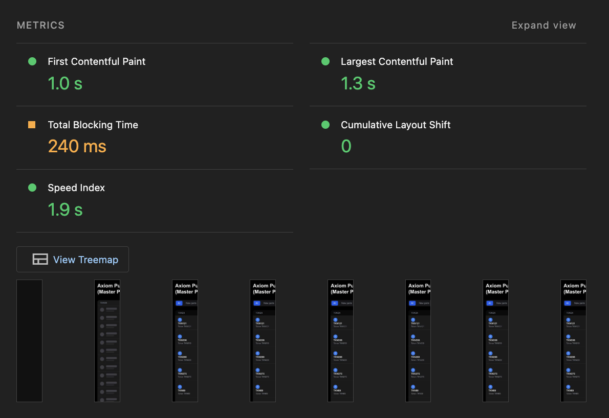

# 📘 **Real-Time Token Intelligence Dashboard (Axiom Pulse Clone)**

# **Real-Time Token Intelligence Platform**

### *(Axiom Pulse Clone — Frontend-Only Master Project)*

A high-performance, fully responsive **token discovery & trading insights dashboard**, inspired by **Axiom Pulse**.
This project focuses entirely on **frontend engineering**, real-time UI behavior, virtualization, and pixel-perfect design—built using **Next.js**, **React Query**, **Redux Toolkit**, **TailwindCSS**, and **Recharts**.

---

## 🚀 **Features Overview**

### ⚡ **Real-Time UI**

* Live price updates (200ms mock WebSocket stream)
* Smooth **green/red flash animations** on price change
* Optimized React Query caching
* No lag due to **memoized components**

### 📊 **Trading Table UI**

* Pixel-perfect table layout inspired by Axiom Pulse
* Category filters: **New Pairs, Final Stretch, Migrated, All**
* Sorting on: **Price, 24h %, Liquidity, Volume**
* Virtualized list for 500+ tokens (TanStack Virtual)
* Sparkline charts (Recharts)
* Sticky table header

### 🎛 **Interactive UX**

* Token hover popover showing quick stats
* Tooltip on status badge
* Token detail modal with extended info
* Beautiful hover effects
* Fully responsive (320px → desktop)

### 🧱 **Engineering Excellence**

* Atomic design structure: `atoms → molecules → organisms → templates`
* Strict TypeScript
* Redux Toolkit for UI state
* React Query for async & caching
* TailwindCSS with tailwind-merge
* Clean folder structure
* Storybook-ready components

---

## 📁 **Project Structure**

```
/src
  /components
    /atoms
    /molecules
    /organisms
    /templates
    /ui
  /lib
    /hooks
    /utils
    /constants
  /store
  /types
  /services
  /app
/docs
/backend (optional – not required)
```

---

## 🛠 **Tech Stack**

| Category         | Technology              |
| ---------------- | ----------------------- |
| Framework        | Next.js 14 (App Router) |
| Language         | TypeScript              |
| Styling          | TailwindCSS             |
| Data Layer       | React Query             |
| State Management | Redux Toolkit           |
| Virtualization   | TanStack Virtual        |
| Charts           | Recharts                |
| Icons            | Lucide React            |
| Utilities        | tailwind-merge, clsx    |

---

## 📦 **Installation**

```bash
npm install
npm run dev
```

Runs locally at
👉 `http://localhost:3000`

---

## 📸 **Screenshots (Add these images in README)**


### 1. **Main Dashboard (Desktop View)**


### 2. **Hover Popover**


### 3. **Status Tooltip**


### 4. **Sorting Interaction**



### 5. **Token Detail Modal**


### 6. **Real-Time Flash Animation**


### 7. **Mobile View (320px)**



### 8. **Lighthouse Scores (Desktop + Mobile)**


---
## 📹 **Demo Video (YouTube)**

> *(Add your 1–2 minute overview video here)*

🎥 **YouTube Link:** [Check Youtube video for demonstration here!!!](https://youtu.be/iiJ0IfCqFyc)

---

## 🌐 **Live Deployment**

> *(Replace with your Vercel URL)*
> 🔗 **Live Demo:** [Check Out Here!!!](https://realtime-token-intelligence-platfor.vercel.app/)

---

## 📚 **Architecture Notes**

* Real-time updates handled via mock WebSocket generator.
* Heavy UI rendering optimized using virtualization and memoization.
* Table reflows eliminated with fixed column widths.
* Sparkline charts rendered with minimal cost via Recharts tiny charts.
* State split cleanly between:

  * **React Query → data**
  * **Redux Toolkit → UI**

---

## 🧪 **Storybook (Optional)**

```bash
npm run storybook
```

---

## 🏆 **Author**

**thistooshallpass**
Frontend Engineer • Real-Time UI Specialist

---

## 📄 License

MIT License

---
